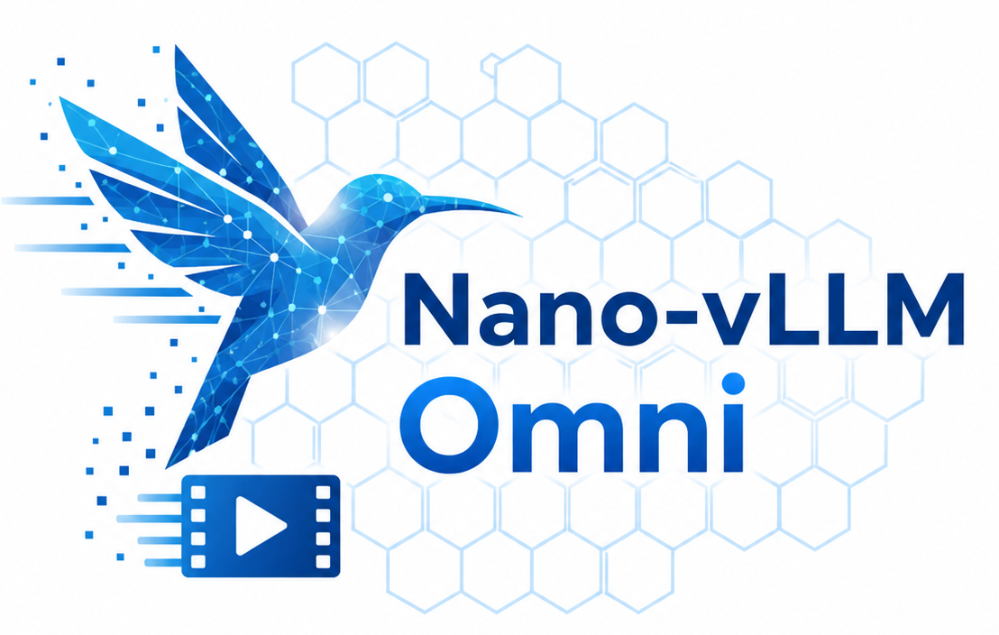

<p align="center">

</p>

# Nano-vLLM-Omni

A lightweight `vLLM-Omni`-style diffusion implementation built around `Wan2.2-TI2V-5B-Diffusers`.

## Key Features

* 🚀 **Real engine boundaries** - explicit `request -> scheduler -> runner -> pipeline`
* 📖 **Readable codebase** - core implementation in ~`1,079` lines of Python for studying diffusion serving
* ⚡ **Step execution** - preserves the `prepare_encode -> denoise_step -> step_scheduler -> post_decode` contract from `vllm-omni`
* 🧠 **Minimal reuse path** - CPU prompt-embedding cache as the diffusion analogue of prefix/KV reuse
* 💾 **Practical memory path** - explicit module-level CPU offload for a 24GB 3090

## What It Keeps

This project keeps the core `vllm-omni diffusion` shape:

- explicit scheduler-owned request lifecycle
- per-request mutable runner state
- step-wise denoising instead of one giant `pipe(...)` call
- a dedicated pipeline adapter instead of hiding all logic inside Diffusers

It does **not** try to reimplement distributed executors, cache backends, tensor parallel diffusion, or multi-model orchestration.

## Installation

This project was validated with Python `3.10`, a CUDA-capable NVIDIA GPU, and `ffmpeg`.

1. Create an environment.

```bash
conda create -n nano-vllm-omni python=3.10 -y
conda activate nano-vllm-omni
```

2. Install a CUDA-enabled PyTorch build that matches your system.

Example for CUDA `12.1`:

```bash
python -m pip install torch torchvision torchaudio --index-url https://download.pytorch.org/whl/cu121
```

If your machine uses a different CUDA version, use the selector on the official PyTorch site instead of this example.

3. Install system `ffmpeg`.

Ubuntu:

```bash
sudo apt-get update
sudo apt-get install -y ffmpeg
```

4. Install this project and the Hugging Face CLI.

This project currently depends on the `Wan` pipeline from the `diffusers` main branch, so `pip install -e .` will fetch `diffusers` from GitHub automatically.

```bash
python -m pip install -e .
python -m pip install huggingface_hub
```

## Model Download

This repo expects the Wan model under `./models/Wan2.2-TI2V-5B-Diffusers`.

Create the directory and download the official Diffusers weights:

```bash
mkdir -p models
huggingface-cli download --resume-download Wan-AI/Wan2.2-TI2V-5B-Diffusers \
  --local-dir ./models/Wan2.2-TI2V-5B-Diffusers \
  --local-dir-use-symlinks False
```

The repository already includes a demo image at `./assets/i2v_input.JPG`, so no extra asset download is required for the default example.

## Sample Inputs

The repo includes the official Wan TI2V sample input image under `./assets`:

- `i2v_input.JPG`: the official Wan cat-on-surfboard example

Source and license details are listed in [assets/README.md](/home/zhangrx/learnVLLM/nano-vllm-omni/assets/README.md:1).

## Quick Start

After the model is downloaded, this command should run end-to-end:

```bash
CUDA_VISIBLE_DEVICES=0 python example_wan22_i2v.py \
  --model ./models/Wan2.2-TI2V-5B-Diffusers \
  --image ./assets/i2v_input.JPG \
  --preset quality \
  --output ./output/example_wan22_i2v_quality.mp4
```

Or via the CLI entrypoint:

```bash
CUDA_VISIBLE_DEVICES=0 nano-vllm-omni \
  --model ./models/Wan2.2-TI2V-5B-Diffusers \
  --image ./assets/i2v_input.JPG \
  --preset quality \
  --output ./output/example_wan22_i2v_quality.mp4
```

The current defaults in `nanovllm_omni/config.py` point to these same repo-relative paths, so after you place the model under `./models/Wan2.2-TI2V-5B-Diffusers`, the explicit `--model` and `--image` flags become optional.

The CLI also accepts `--negative-prompt`. The default negative prompt already suppresses `ghosting`, `double image`, `duplicate subject`, and `motion trails`.

## Preset

- `quality`: target 480P-class area, `17` frames, `12` steps, `flow_shift=3.0`

## Performance Comparison

See `bench.py` for the benchmark used below.

**Test Configuration:**
- Hardware: RTX 3090 24GB
- Model: `Wan2.2-TI2V-5B-Diffusers`
- Input: `./assets/i2v_input.JPG`
- Resolution: `576x768`
- Frames: `17`
- Sampler: `Euler`
- Inference Steps: `12`
- Metric: post-load `generate` time only, including text embedding and video generation
- Warmup: `1` run, then `5` timed runs

**Performance Results:**

| Inference Engine | Mean Generate Time (s) | Min (s) | Max (s) | Notes |
|------------------|------------------------|---------|---------|-------|
| `vllm-omni`      | `28.2445`              | `28.1874` | `28.3386` | official `0.18.0` |
| `nano-vllm-omni` | `25.8918`              | `25.0985` | `26.7400` | current implementation |

On this single-GPU Wan2.2 I2V benchmark, `nano-vllm-omni` is about `9.1%` faster than the official `vllm-omni` path while keeping the codebase small and readable.

## Notes

- `ffmpeg` is required to export frames to `mp4`.
- Pure full-GPU decode OOMed on this 24GB card at higher resolutions, so CPU offload stays enabled by default.
- The current implementation is optimized for clarity first: single process, single GPU, one scheduled diffusion step at a time.


## Layout

- `config.py`: engine/runtime configuration
- `sampling_params.py`: runtime sampling arguments and the validated `quality` preset
- `request.py`: user-facing request object
- `cache.py`: CPU-side prompt embedding cache
- `sched/interface.py`: scheduler contract and request state
- `sched/base_scheduler.py`: waiting/running/finished queue bookkeeping
- `sched/step_scheduler.py`: step-wise diffusion scheduler
- `worker/utils.py`: per-request runner state and runner output
- `models/interface.py`: minimal step-execution pipeline protocol
- `models/wan22/pipeline.py`: Wan2.2 TI2V/I2V step-execution pipeline adapter
- `engine/model_runner.py`: step-wise request execution and state cache
- `engine/omni_engine.py`: top-level engine loop
- `llm.py`: user-facing API
- `utils.py`: resize/export helpers

## Acknowledgements

- [nano-vllm](https://github.com/GeeeekExplorer/nano-vllm) for showing how to turn a high-performance serving stack into a compact, readable teaching implementation.
- [vllm-omni](https://github.com/vllm-project/vllm-omni) for the diffusion-serving architecture and execution model that this project studies and simplifies.
